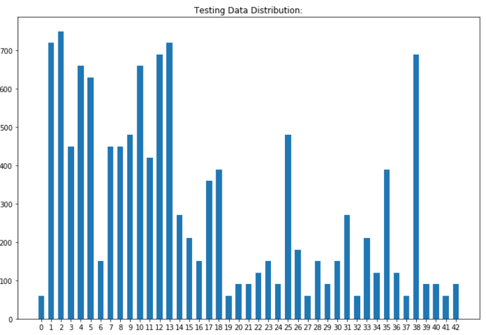

# **Traffic Sign Recognition** 

## Writeup

**Build a Traffic Sign Recognition Project**

The goals / steps of this project are the following:
* Load the data set (see below for links to the project data set)
* Explore, summarize and visualize the data set
* Design, train and test a model architecture
* Use the model to make predictions on new images
* Analyze the softmax probabilities of the new images
* Summarize the results with a written report

[//]: # (Image References)

[image1]: ./examples/visualization.jpg "Visualization"
[image2]: ./examples/grayscale.jpg "Grayscaling"
[image3]: ./examples/random_noise.jpg "Random Noise"
[image4]: ./examples/placeholder.png "Traffic Sign 1"
[image5]: ./examples/placeholder.png "Traffic Sign 2"
[image6]: ./examples/placeholder.png "Traffic Sign 3"
[image7]: ./examples/placeholder.png "Traffic Sign 4"
[image8]: ./examples/placeholder.png "Traffic Sign 5"

## Rubric Points
### Here I will consider the [rubric points](https://review.udacity.com/#!/rubrics/481/view) individually and describe how I addressed each point in my implementation.  

---
### Writeup / README

#### 1. Provide a Writeup / README that includes all the rubric points and how you addressed each one. You can submit your writeup as markdown or pdf. You can use this template as a guide for writing the report. The submission includes the project code.

You're reading it! and here is a link to my [project code](https://github.com/Dios-Malone/CarND-Traffic-Sign-Classifier-Project/blob/master/Traffic_Sign_Classifier.ipynb)

### Data Set Summary & Exploration

#### 1. Provide a basic summary of the data set. In the code, the analysis should be done using python, numpy and/or pandas methods rather than hardcoding results manually.

I used the pandas library to calculate summary statistics of the traffic
signs data set:

* The size of training set is 34799
* The size of the validation set is 4410
* The size of test set is 12630
* The shape of a traffic sign image is (32, 32, 3)
* The number of unique classes/labels in the data set is 43

#### 2. Include an exploratory visualization of the dataset.

Here is an exploratory visualization of the data set. It is a bar chart showing how the data ...

### Design and Test a Model Architecture

#### 1. Describe how you preprocessed the image data. What techniques were chosen and why did you choose these techniques? Consider including images showing the output of each preprocessing technique. Pre-processing refers to techniques such as converting to grayscale, normalization, etc. (OPTIONAL: As described in the "Stand Out Suggestions" part of the rubric, if you generated additional data for training, describe why you decided to generate additional data, how you generated the data, and provide example images of the additional data. Then describe the characteristics of the augmented training set like number of images in the set, number of images for each class, etc.)

As a first step, I decided to convert the images to grayscale because converting image to grayscale removes a lot of unnecessary information. It make the training faster and the model could focus on the more relevent information.

Here is an example of a traffic sign image before and after grayscaling.

As a last step, I normalized the image data because it shifts the data closer to the origin and could effectively prevent from overfitting.

I decided to generate additional data because more data means more accurate. And more data could cover more edge senarios of the specific traffic sign group. 

To add more data to the the data set, I used the following techniques:
* Randomly rotate the image
* Randomly project the image

Here is an example of an original image and an augmented image:

#### 2. Describe what your final model architecture looks like including model type, layers, layer sizes, connectivity, etc.) Consider including a diagram and/or table describing the final model.

My final model consisted of the following layers:

| Layer         		|     Description	        					| 
|:---------------------:|:---------------------------------------------:| 
| Input         		| 32x32x1 Gray image   							| 
| Convolution 5x5     	| 1x1 stride, VALID padding, outputs 28x28x18	|
| RELU					| Activation									|
| Dropout				| keep rate at 0.7								|
| Max pooling	      	| 2x2 stride,  outputs 14x14x18 				|
| Convolution 5x5     	| 1x1 stride, VALID padding, outputs 10x10x32	|
| RELU					| Activation									|
| Dropout				| keep rate at 0.7								|
| Convolution 5x5     	| 1x1 stride, VALID padding, outputs 6x6x60		|
| RELU					| Activation									|
| Dropout				| keep rate at 0.7								|
| Max pooling	      	| 2x2 stride,  outputs 3x3x60	 				|
| Flatten				| outputs 540									|
| Fully connected		| outputs 120      								|
| RELU					| Activation									|
| Dropout				| keep rate at 0.7								|
| Fully connected		| outputs 84      								|
| RELU					| Activation									|
| Fully connected		| outputs 43      								|
| Softmax				| etc.        									|

 

#### 3. Describe how you trained your model. The discussion can include the type of optimizer, the batch size, number of epochs and any hyperparameters such as learning rate.

To train the model, I used an softmax_cross_entropy_with_logits to calcuate the cross entropy and provided it to reduce_mean to get loss value. Then I choosed AdamOptimizer with training rate 0.001 to train the model. During the training, I kept the batch size from previous LeNet lab as I didn't feel the training slow and I increased the epochs to 20 so that I could get a better result. 

#### 4. Describe the approach taken for finding a solution and getting the validation set accuracy to be at least 0.93. Include in the discussion the results on the training, validation and test sets and where in the code these were calculated. Your approach may have been an iterative process, in which case, outline the steps you took to get to the final solution and why you chose those steps. Perhaps your solution involved an already well known implementation or architecture. In this case, discuss why you think the architecture is suitable for the current problem.

My final model results were:
* training set accuracy of 99.9%
* validation set accuracy of 96.7% 
* test set accuracy of 95.8%

If an iterative approach was chosen:
* What was the first architecture that was tried and why was it chosen?
	* The first architecture used was following LeNet lab. I choosed it as a starting point to test how good it is.
* What were some problems with the initial architecture?
	* The accuracy just stopped around 0.89 no matter how I tuned the hyperparameters	
* How was the architecture adjusted and why was it adjusted? Typical adjustments could include choosing a different model architecture, adding or taking away layers (pooling, dropout, convolution, etc), using an activation function or changing the activation function. One common justification for adjusting an architecture would be due to overfitting or underfitting. A high accuracy on the training set but low accuracy on the validation set indicates over fitting; a low accuracy on both sets indicates under fitting.
	* I first added a dropout layer after each activation. They were added because I would like to force less information to be used in the training, so that the model could be trained in a way that it can predict the right result with less information. In return, it could increase the accuracy. This adjustment helped me increasing the accuracy to around 92%
	* Next step, I added a convolution layer. At the first moment when I thought of adding this layer, I remember the words "the deeper the network is, the result is always better". After I added, I found the training time is still acceptable. And finally I got my accuracy above 0.93.
	* At last, I realized a reminder from my mentor. He told me that not use dropout before the last layer. I tried to remove my dropout layer before last layer. The accuracy surprisingly raised to 0.95. In the end, I understood that the dropout layer before the last layer would drop the predictions there. It means the even the model predicts the correct answer, it might be dropped out there.
* Which parameters were tuned? How were they adjusted and why?
	* The epoch was tuned up to 100, but eventually I fixed it at 20. Even through the more epochs it runs meaning that the model is trained more, too many epochs also means longer time for training. And it also causes the model to overfiting.

 

### Test a Model on New Images

#### 1. Choose five German traffic signs found on the web and provide them in the report. For each image, discuss what quality or qualities might be difficult to classify.

Here are five German traffic signs that I found on the web:

![image1][new_images\image_6.PNG] ![image2][new_images\image_7.PNG] ![image3][new_images\image_8.PNG] 
![image4][new_images\image_9.PNG] ![image5][new_images\image_10.PNG]

All of the 5 images should be very easily classified because they are all very clear. They were taken under a good weather condition. There is nothing hiding the appearance and the lighting is also just good.

#### 2. Discuss the model's predictions on these new traffic signs and compare the results to predicting on the test set. At a minimum, discuss what the predictions were, the accuracy on these new predictions, and compare the accuracy to the accuracy on the test set (OPTIONAL: Discuss the results in more detail as described in the "Stand Out Suggestions" part of the rubric).

Here are the results of the prediction:

| Image			      			|     Prediction	        					| 
|:-----------------------------:|:---------------------------------------------:| 
| Speed limit (70km/h)			| Speed limit (70km/h)							| 
| Priority road					| Priority road 								|
| Road work						| Dangerous curve to the right					|
| Turn right ahead 				| Turn right ahead				 				|
| Road narrows on the left		| Road narrows on the right						|

The model was able to correctly guess 3 of the 5 traffic signs, which gives an accuracy of 60%. This compares worse to the accuracy on the test set of 95.8%

#### 3. Describe how certain the model is when predicting on each of the five new images by looking at the softmax probabilities for each prediction. Provide the top 5 softmax probabilities for each image along with the sign type of each probability. (OPTIONAL: as described in the "Stand Out Suggestions" part of the rubric, visualizations can also be provided such as bar charts)

The code for making predictions on my final model is located in the 22nd cell of the Ipython notebook.

For the first image, the model is absolutely sure that this is a Speed limit (70km/h) (probability of 0.970), and the image does contain a Speed limit (70km/h) sign. The top five soft max probabilities were

| Probability         	|     Prediction	        					| 
|:---------------------:|:---------------------------------------------:| 
| 0.970         		| Speed limit (70km/h)							| 
| 0.025     			| Speed limit (120km/h)							|
| 0.005					| Speed limit (20km/h)							|
| 0.000	      			| Speed limit (30km/h)			 				|
| 0.000				    | Traffic signals      							|

For the second image, the model is also very sure that this is a priority sign (probability of 0.834), and the image does contain a priority sign. The top five soft max probabilities were

| Probability         	|     Prediction	        					| 
|:---------------------:|:---------------------------------------------:| 
| 0.834         		| Priority Road									| 
| 0.119     			| Speed limit (50km/h)							|
| 0.024					| Yield											|
| 0.005	      			| Stop							 				|
| 0.005				    | Double curve      							|

For the third image, the model is relatively sure that this is a sign of Dangerous curve to the right (probability of 0.721), and the image does not actually contains a sign of dangerous curve. Instead, the 2nd top prediction is the correct one. The top five soft max probabilities were

| Probability         	|     Prediction	        					| 
|:---------------------:|:---------------------------------------------:| 
| 0.721         		| Dangerous curve to the right					| 
| 0.279     			| Road work										|
| 0.000					| Keep right									|
| 0.000	      			| Children crossing				 				|
| 0.000				    | Beware of ice/snow							|

For the forth image, the model is absolutely sure that this is a sign of Turn right ahead (probability of 1.000), and the image contains a sign of Turn right ahead. The top five soft max probabilities were

| Probability         	|     Prediction	        					| 
|:---------------------:|:---------------------------------------------:| 
| 1.000         		| Turn right ahead								| 
| 0.000     			| Right-of-way at the next intersection			|
| 0.000					| Ahead only									|
| 0.000	      			| Speed limit (100km/h)			 				|
| 0.000				    | Go straight or left							|

For the last image, the model is relatively sure that this is a sign of Road narrows on the right (probability of 0.912), and the image contains a sign of Road narrows on the left. The sign and the predicted sign are very similar and the most important thing is that this sign is not really in the training data classes. Hence, there is no doubt that the model classify this image wrongly. But impressively the predicted sign is so close to this one. The top five soft max probabilities were

| Probability         	|     Prediction	        					| 
|:---------------------:|:---------------------------------------------:| 
| 0.912         		| Road narrows on the right						| 
| 0.049     			| Dangerous curve to the right					|
| 0.031					| Pedestrians									|
| 0.007	      			| Children crossing				 				|
| 0.001				    | General caution								|

### (Optional) Visualizing the Neural Network (See Step 4 of the Ipython notebook for more details)
#### 1. Discuss the visual output of your trained network's feature maps. What characteristics did the neural network use to make classifications?

